Back to the Island
==================

js13kGames 2019 entry, theme: "back".

An H. P. Lovecraft-inspired game written in JavaScript.

Competition entry: [http://js13kgames.com/entries/back-to-the-island](http://js13kgames.com/entries/back-to-the-island)

Post-Compo Demo
---------------

Work continues on Back to the Island post-competition.

"I had no intention, none whatsoever, of going back... BACK TO THE ISLAND."

Avoid the critters roaming the grasslands, collect coins, and make your way to
the chequered flag to advance to the next island. Rinse and repeat.

Arrow keys, WASD, or ZQSD to move on desktop; virtual joystick to move on
mobile/tablet.

[Play now!](https://ajbkr.github.io/back/)

Dependencies
------------

Back to the Island makes use of the following libraries/tools:

* [autotile](https://www.npmjs.com/package/autotile)
* [cave-automata-2d](https://www.npmjs.com/package/cave-automata-2d)
* [Kontra](https://straker.github.io/kontra/)
* [Virtual Stick](https://www.npmjs.com/package/virtual-stick)
* [ZzFX](http://www.3d2k.com/js/zzfx/)

Screenshots
-----------

### 0.0.2

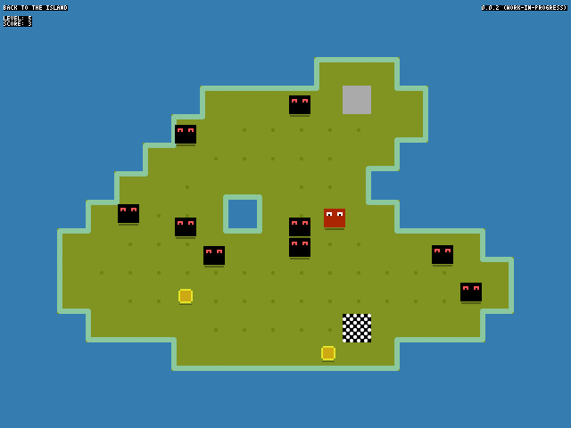
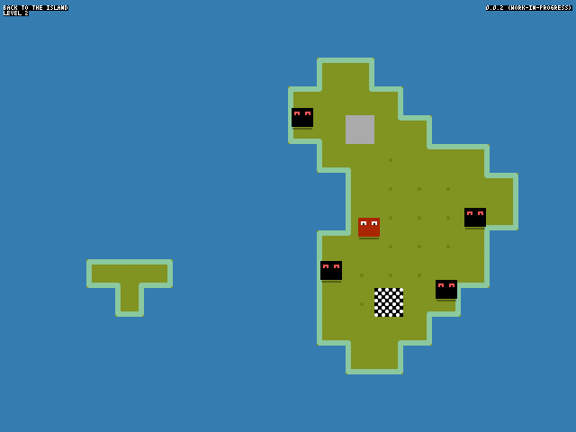

### 0.0.1

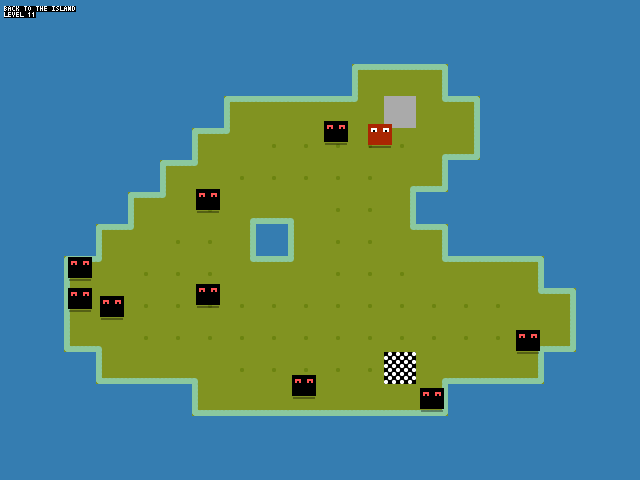
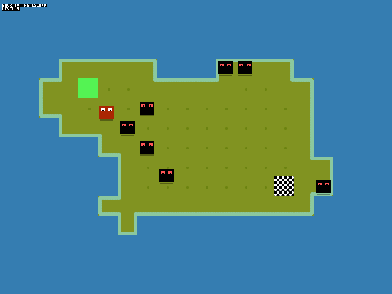
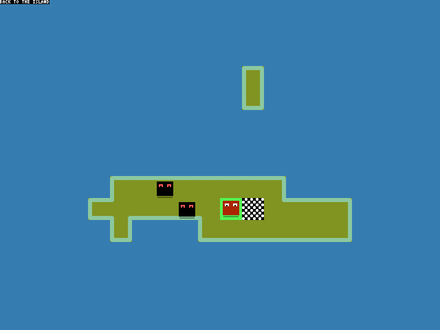
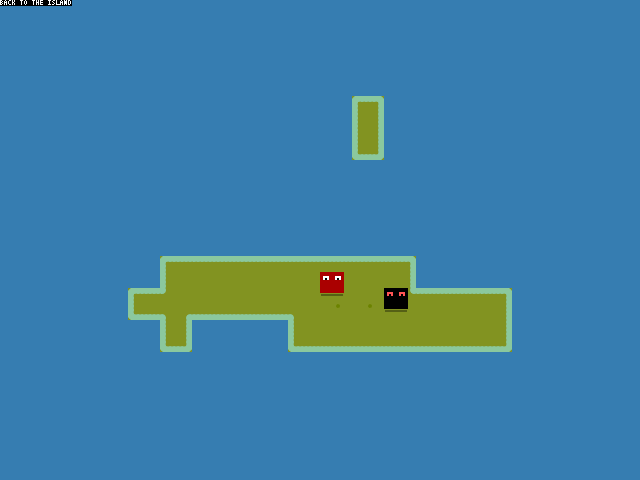

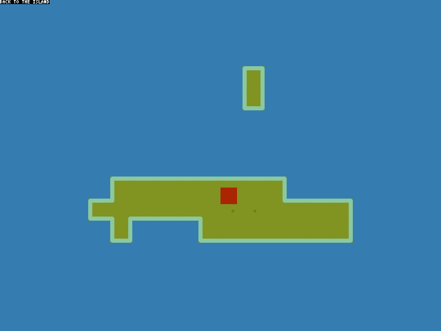
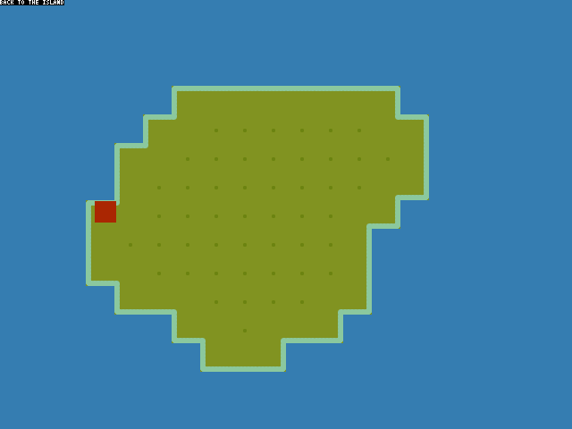
")
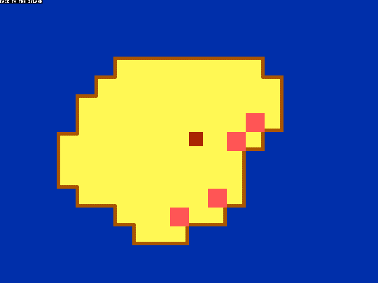
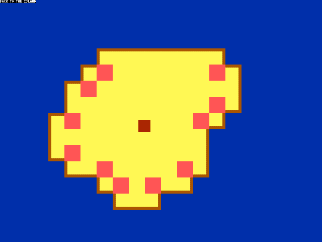
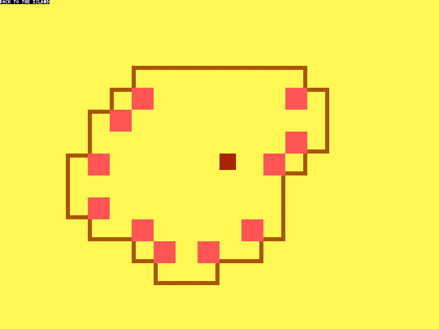
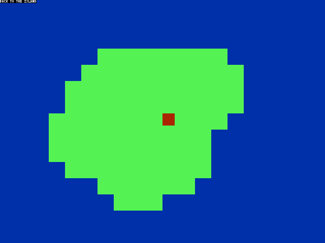
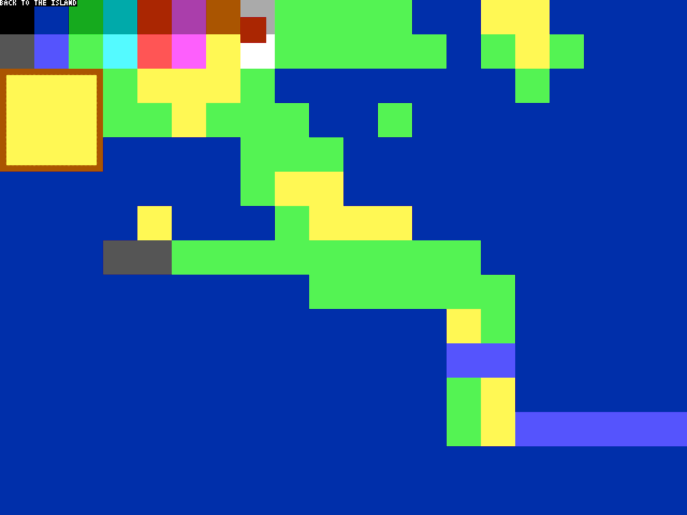
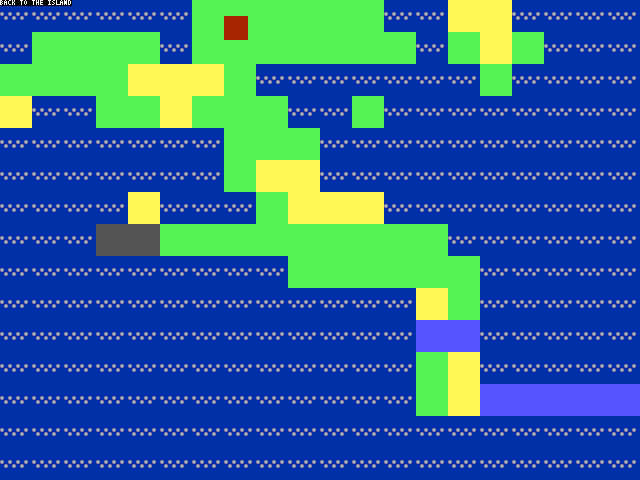
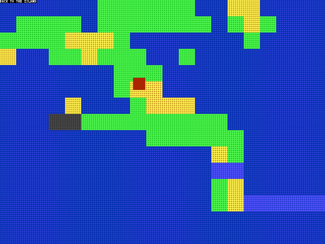
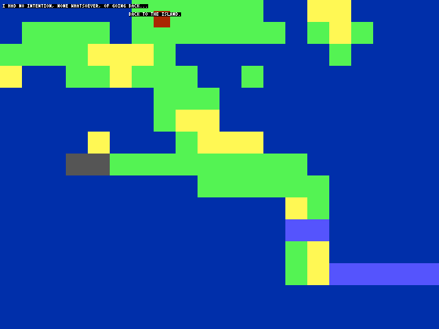

