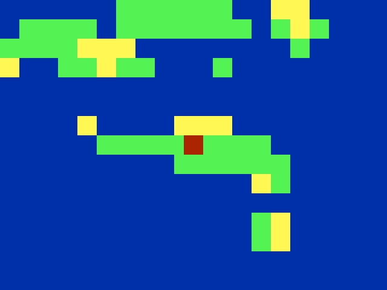

Back [to the Island]
====================

js13kGames 2019 entry, theme: "back".

An H. P. Lovecraft-inspired mini-RPG/adventure game written in JavaScript using
the [Kontra](https://straker.github.io/kontra/) micro-library.

Live Demo
---------

[Play now!](https://ajbkr.github.io/back/)

Arrow keys to move on desktop; virtual joystick to move on mobile/tablet.

Screenshots
-----------

